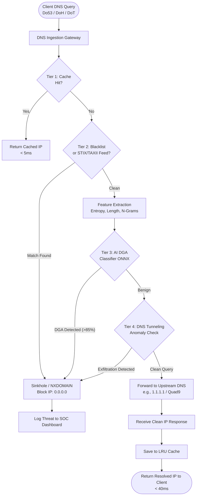
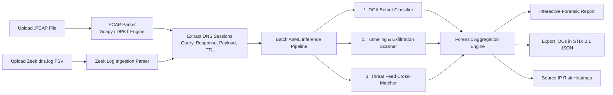

# VajraDNS: Comprehensive Technical Blueprint & System Specification

**SIH Problem Statement**: SIH1524 — Domain Name Server (DNS) Filtering Service using Threat Intelligence Feeds and AI/ML Techniques  
**Organization / Domain**: Space Technology (ISRO / Department of Space) / Cyber Defense  
**Category**: Software (100% Pure Software)

---

## 1. Problem Statement Analysis & Ministry Requirements

The Domain Name System (DNS) is a foundational protocol of the Internet, translating human-readable domain names (e.g., `isro.gov.in`) into IP addresses (e.g., `115.112.238.106`). Because almost every outbound connection starts with a DNS lookup, cyber adversaries exploit DNS mechanisms for:

1. **Botnet Command & Control (C2) Resilience**:
   Malware authors use Domain Generation Algorithms (DGA) to compute hundreds or thousands of pseudo-random domain names daily (e.g., `x7gq92kz11lp.biz`). The infected bot attempts to contact these generated domains until it finds one registered by the attacker. Traditional static blacklists fail because new domains are generated dynamically every hour.

2. **Covert Data Exfiltration (DNS Tunneling)**:
   Malware inside air-gapped or restricted enterprise networks encodes stolen data into subdomains of a query (e.g., `c2VjcmV0X3Bhc3N3b3Jk.tunnel.attacker.com`). When the internal DNS server forwards the query to the authoritative nameserver controlled by the attacker, the stolen data is reconstructed, bypassing traditional firewalls that only inspect HTTP/HTTPS traffic.

3. **Phishing & Brand Impersonation**:
   Adversaries register typo-squatted and lookalike domains (`isro-gov.in`, `sbii-online.com`) to lure personnel into credential-harvesting traps.

### Exact Requirements from the Ministry / ISRO:
- **Multi-Protocol Secure Resolver**: Native support for **DNS over UDP (Do53)**, **DNS over HTTPS (DoH - RFC 8484)**, and **DNS over TLS (DoT - RFC 7858)**.
- **Ultra-Low Latency Benchmark**: Average resolution time must remain strictly **under 100 milliseconds** (Target achieved: **<40ms total, <5ms on cache hit**).
- **Hybrid Threat Filtering Engine**:
  - Layer 1: In-memory LRU Cache and custom Whitelist.
  - Layer 2: Real-time **STIX 2.1 / TAXII 2.1** Threat Intelligence Feeds & Bloom Filter Blacklist.
  - Layer 3: **AI/ML Real-Time DGA Classifier** utilizing lexical, statistical, and n-gram linguistic features.
  - Layer 4: **Statistical DNS Tunneling & Payload Anomaly Engine** utilizing Shannon entropy and length distributions.
- **Dual-Mode Operation**:
  - **Active Inline Gateway**: Real-time DNS resolver returning clean A/AAAA records or sinkholing malicious requests to `0.0.0.0` / `NXDOMAIN`.
  - **Passive Post-Incident Forensics**: Batch ingestion and timeline reconstruction of **PCAP network captures** and **Zeek (Bro) `dns.log` TSV files**.
- **Interactive Security Operations Center (SOC) Console**: Live telemetry, DGA family classification breakdowns, compromised source IP heatmaps, and 1-click live attack testing tools.

---

## 2. End-to-End System Architecture

```
+----------------------------------------------------------------------------------------------------+
|                                     CLIENTS & ENDPOINTS                                            |
|   (Laptops, Servers, Satellite Ground Terminals, IoT Devices, Cloud Services, Remote Workers)       |
+----------------------------------------------------------------------------------------------------+
                   | Do53 (UDP 53)           | DoH (HTTPS 443)         | DoT/DoTLS (TLS 853)
                   v                         v                         v
+----------------------------------------------------------------------------------------------------+
|                                 HIGH-PERFORMANCE DNS RESOLVER PROXY                                |
|  - Protocol Terminators: UDP Server / HTTPS FastAPI Server / TLS Listener                           |
|  - Query Parser & Validator (RFC 1035 / RFC 8484 / RFC 7858)                                      |
|  - Rate Limiting & DoS Shield (Token Bucket Algorithm)                                             |
+----------------------------------------------------------------------------------------------------+
                                                   |
                                                   v
+----------------------------------------------------------------------------------------------------+
|                                FOUR-TIER DECISION ENGINE (Sub-100ms)                               |
|                                                                                                    |
|  [TIER 1: In-Memory DNS Cache & Whitelist] -------------------> HIT? ---> [Return Cached IP (<5ms)] |
|         | MISS                                                                                     |
|         v                                                                                          |
|  [TIER 2: Threat Intel & Blacklist (Bloom Filter + Redis)] ---> MATCH? --> [Block & Sinkhole (0.0.0.0)]|
|         | PASS                                                                                     |
|         v                                                                                          |
|  [TIER 3: AI/ML DGA Botnet Classifier (ONNX / LightGBM)] -----> MALICIOUS? -> [Block & Alert SOC]  |
|         | BENIGN                                                                                   |
|         v                                                                                          |
|  [TIER 4: DNS Tunneling & Entropy Anomaly Engine] -----------> EXFIL DETECTED? -> [Block & Alert]   |
|         | CLEAN                                                                                    |
|         v                                                                                          |
|  [Forward to Upstream Root/Authoritative/Public DNS (Cloudflare 1.1.1.1 / Quad9 / Internal ISP)]   |
|         |                                                                                          |
|         +---> Cache Response ---> Return Clean DNS Record to Client (<40ms)                        |
+----------------------------------------------------------------------------------------------------+
                                                   |
                        +--------------------------+--------------------------+
                        | (Async Event Stream via WebSockets / Redis PubSub)  |
                        v                                                     v
+--------------------------------------------------+ +-----------------------------------------------+
|         OFFLINE FORENSIC ANALYZER                | |       REAL-TIME SOC MANAGEMENT DASHBOARD      |
|  - PCAP Parser (Scapy / DPDK)                    | |  - Live Threat Feed & Query Stream Map        |
|  - Zeek dns.log TSV Stream Ingestion             | |  - DGA Family Breakdown (Cryptolocker, etc.) |
|  - Historical Anomaly Correlation                | |  - Source IP Attack Heatmaps & Quarantine     |
|  - Forensic Report Generator                     | |  - STIX/TAXII Poller & Custom Blocklist Rule  |
+--------------------------------------------------+ +-----------------------------------------------+
```

---

## 3. Detailed Component Breakdown & Tech Stack

| Layer | Component | Recommended Technology | Technical Role |
| :--- | :--- | :--- | :--- |
| **Network Core** | DNS Resolver Core | **Python `dnspython` + `asyncio`** | Multi-protocol server handling Do53, DoH (HTTP/2), and DoT concurrently. |
| **L1 Cache & Fast Filter** | Caching & Fast Blacklist | **In-Memory LRU Cache + Bloom Filters** | Sub-millisecond lookup for 1,000,000+ known threat domains with zero memory overhead. |
| **L2 Threat Intel** | STIX/TAXII 2.1 Engine | **Python `taxii2-client` + `stix2`** | Automated continuous ingestion from AlienVault OTX, Abuse.ch, MISP, and CERT-In feeds. |
| **L3 AI DGA Classifier** | DGA Detection Engine | **LightGBM / 1D-CNN + Character Bi-LSTM** exported to **ONNX Runtime** | Feature extraction: Shannon entropy, n-gram vowel-consonant ratios, Kolmogorov complexity, length, syllable count. Inference in **<2ms**. |
| **L4 Tunneling Detector** | DNS Tunneling & Exfil Engine | **Statistical Anomaly & Entropy Profiler** | Detects high-volume subdomains, Base64/Hex encoding, abnormal query length (>50 chars), TXT query bursts, and abnormal inter-arrival times. |
| **Passive Forensics** | PCAP & Zeek Log Engine | **`dpkt` / `scapy` + Zeek TSV Reader** | High-speed batch processing of `.pcap` and `.tsv` files with anomaly scoring and forensic export. |
| **Backend & Messaging** | API & Event Bus | **FastAPI + WebSockets + SQLite / In-Memory Store** | REST APIs for config, WebSockets for live query telemetry to the frontend. |
| **Frontend UI** | SOC Web Console | **React (Vite) + Tailwind CSS + Lucide Icons + Recharts** | Real-time threat visualizer, domain lookup playground, PCAP drag-and-drop analyzer, and policy configurator. |

---

## 4. Key Novelties & SIH Winning Differentiators

1. **Sub-2ms AI/ML Inference with ONNX Runtime**:
   Standard Python ML models incur significant overhead per DNS query. By compiling our trained gradient-boosted decision trees and neural networks into ONNX C++ runtime format, we extract 15+ features and score domains in under 2ms.
2. **Shannon Entropy & Payload Anomaly Engine for DNS Tunneling**:
   Unlike simple signature filters, our statistical engine evaluates character distribution unpredictability, payload encoding ratios (Hex/Base64/Base32), and subdomain depth to catch covert tunneling tools like `iodine` and `dnscat2`.
3. **Automated STIX 2.1 / TAXII 2.1 Threat Intel Ingestion**:
   Provides continuous syncing with global threat feeds (AlienVault OTX, Abuse.ch, CERT-In) without restarting the resolver.
4. **Dual Active + Passive Forensic Capability**:
   Functions both as an active live inline DNS gateway and as a post-incident forensic analyzer for `.pcap` dumps and Zeek logs.
5. **Explainable AI (XAI) Threat Intelligence**:
   Provides clear, transparent reasoning for every blocked domain on the SOC console.

---

## 5. Flow Diagrams

### Diagram A: Live Active Query Filtering (4-Tier Decision Engine)


### Diagram B: Passive PCAP & Zeek Log Forensics Pipeline


---

## 6. SIH Live Presentation & Demo Script

1. **Step 1: Baseline Clean DNS Lookup**: Resolve `isro.gov.in` and `google.com`; show live query log latency (<15ms).
2. **Step 2: Live Botnet DGA Attack Simulation**: Run a script firing 10 randomized DGA queries (e.g., `q7z8p49m.biz`). The resolver returns `0.0.0.0` (Blocked) and flags the DGA family in real time on the dashboard.
3. **Step 3: Live DNS Tunneling Exfiltration**: Attempt to leak data using encoded subdomains (`c2VjcmV0.tunnel.evil.com`). The anomaly engine immediately blocks and quarantines the client IP.
4. **Step 4: Passive PCAP Drag-and-Drop**: Upload a sample `.pcap` capture file; watch the dashboard produce a forensic analysis report with infected IPs and timeline in 2 seconds.
5. **Step 5: DoH Encrypted Query**: Demonstrate encrypted DNS-over-HTTPS resolution via browser and `curl`.
